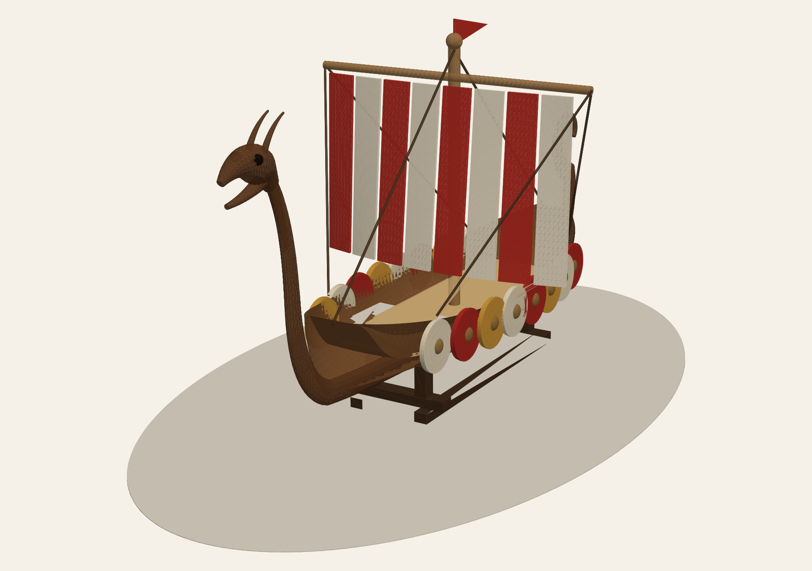
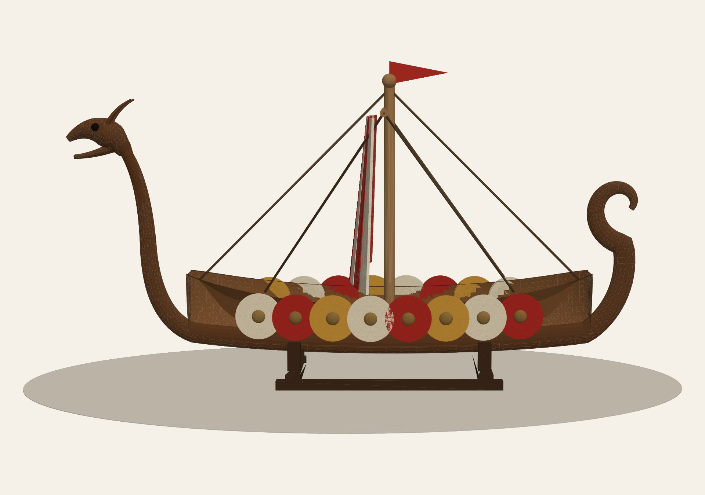
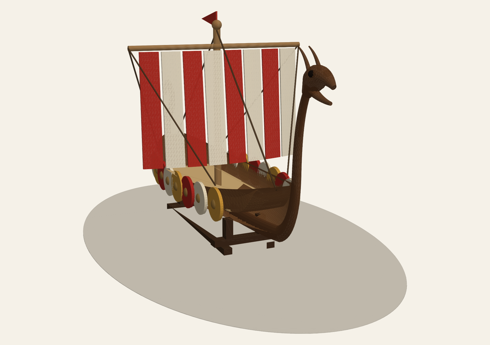
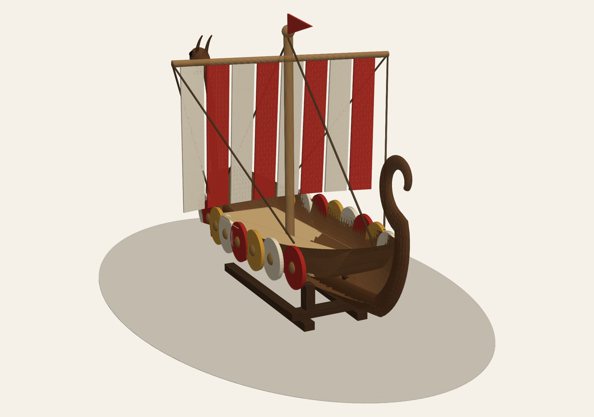
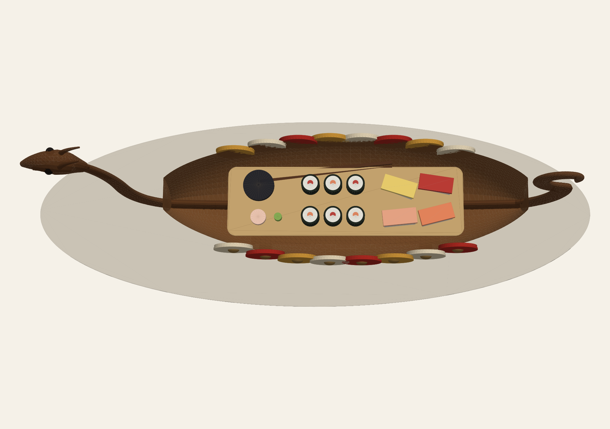
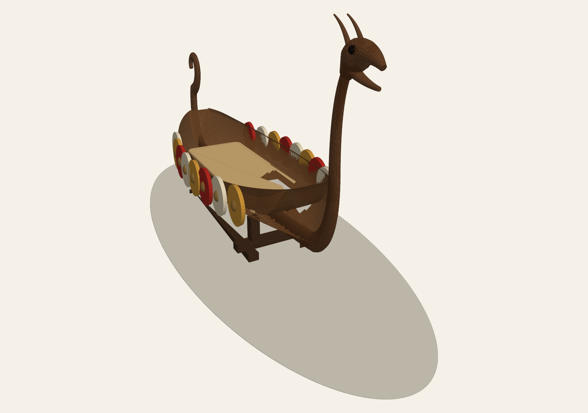
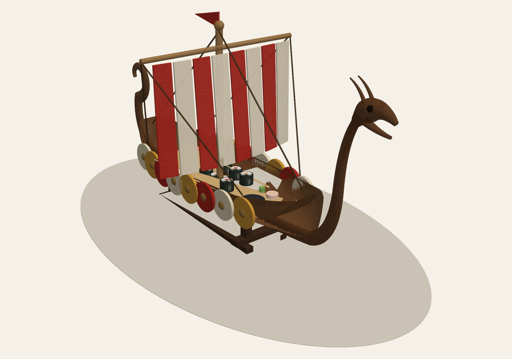
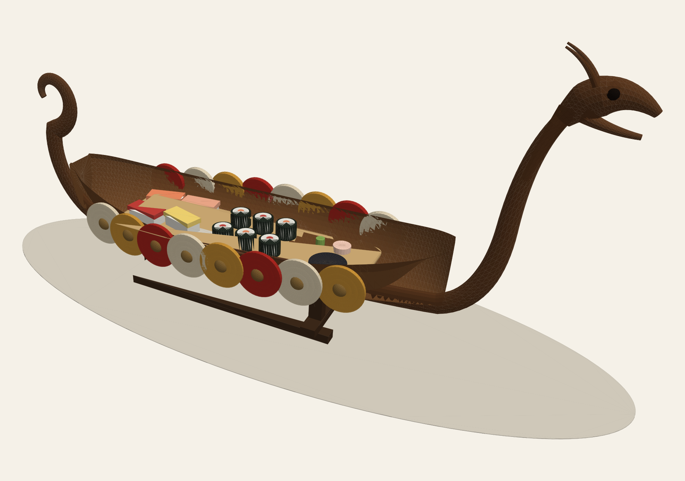

# Viking Sushi Boat — One-Piece Carved 3D Design

A sculptural, one-piece Viking longship sushi serving boat, modelled in 3D.
The hull, keel, curled spiral sternpost, swan-curve dragon neck and gunwales
form **one continuous carved body** (no joints, no assembly), presented on a
low display stand — in the spirit of a traditional carved-wood sushi boat.



## Design

| Feature | Description |
| --- | --- |
| Overall size | ~640 mm over the figureheads, beam 172 mm, ~300 mm to the dragon head |
| Hull | Smoothly lofted round-bilge longship hull with a sweeping sheer line |
| Backbone | One continuous swept keel that rises into the **spiral sternpost** and the **dragon-head bow stem** |
| Serving deck | Recessed deck cavity with a maple serving inset, sized for nigiri/maki platters |
| Shields | 16 overlapping round shields (red / cream / ochre) along the gunwales |
| Sail | Red-and-cream striped square sail with billow, yard, rigging and masthead pennant |
| Stand | Low dark-walnut display cradle |

Suggested build: carved from a single glued-up walnut blank (CNC 4-axis or
hand carving), food-safe mineral-oil/beeswax finish on the serving deck.

## Renders

| | |
| --- | --- |
|  |  |
|  |  |
|  |  |
|  |  |

## Files

```
model/viking_boat_3d.py   parametric 3D model source (numpy + trimesh)
model/render.py           software renderer (matplotlib painter)
model/build_all.py        regenerates every render + export
cad/viking_sushi_boat.glb             full model with sail (colours)
cad/viking_sushi_boat.stl             full model, merged mesh
cad/viking_sushi_boat_carved_only.glb carved boat + stand, no sail
cad/viking_sushi_boat_carved_only.stl
renders/*.png             presentation renders
```

## Regenerating

```bash
pip install numpy trimesh shapely matplotlib mapbox_earcut
python model/build_all.py
```

Every dimension and curve lives in `model/viking_boat_3d.py` — hull length,
beam, sheer/keel curves, recess depth, shield count, sail stripes and the
dragon-head profile are all parametric.
